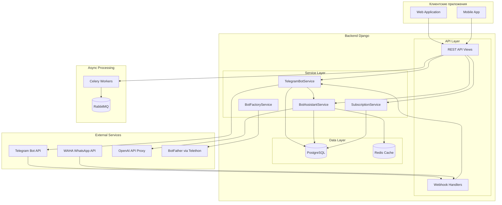
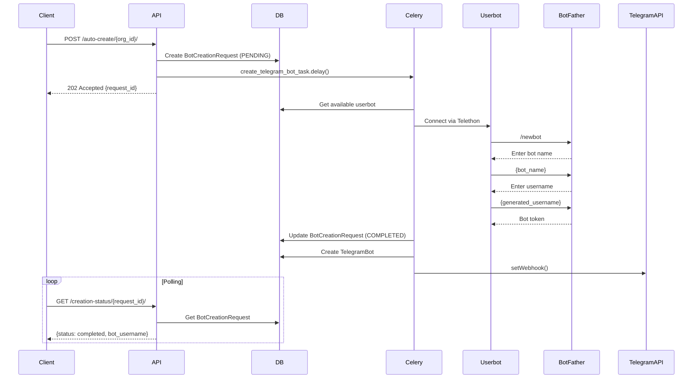
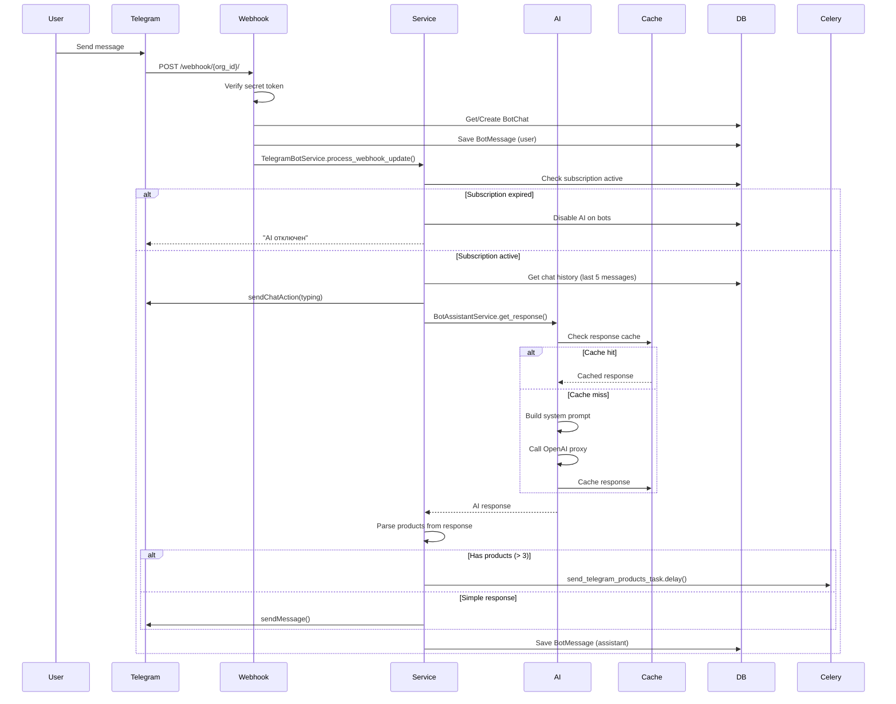

# Архитектура системы Telegram AI-ассистентов

## Обзор

Система позволяет организациям создавать AI-ассистентов для Telegram ботов, которые автоматически отвечают на вопросы клиентов, показывают товары из каталога и обрабатывают запросы.

## Компонентная диаграмма



## Основные компоненты

### 1. API Layer

| Компонент | Файл | Описание |
|-----------|------|----------|
| TelegramBotAPIView | `views.py:528-687` | CRUD для Telegram ботов |
| AutoCreateTelegramBotAPIView | `views.py:1123-1281` | Автосоздание ботов |
| TelegramWebhookView | `views.py:155-335` | Обработка webhook от Telegram |
| OrganizationAssistantView | `assistant_views.py` | Управление AI-ассистентами |

### 2. Service Layer

| Сервис | Файл | Ответственность |
|--------|------|-----------------|
| **TelegramBotService** | `services/telegram.py` | Взаимодействие с Telegram API |
| **BotAssistantService** | `services/assistant.py` | Генерация AI ответов |
| **BotFactoryService** | `services/bot_factory.py` | Создание ботов через BotFather |
| **UserbotAuthService** | `services/bot_factory.py` | Аутентификация Telethon userbot |
| **SubscriptionService** | `subscription_services.py` | Управление подписками |

### 3. Data Layer

#### Модели ботов (`messenger_bots/models.py`)

| Модель | Связи | Назначение |
|--------|-------|------------|
| **TelegramBot** | Organization (1:1) | Конфигурация Telegram бота |
| **WhatsAppBot** | Organization (1:1) | Конфигурация WhatsApp бота |
| **BotChat** | Organization (FK) | Чат с пользователем |
| **BotMessage** | BotChat (FK) | Сообщения в чате |
| **BotCreationRequest** | Organization (FK) | Запрос на создание бота |
| **TelegramUserbot** | - | Userbot для BotFather |

#### Модели подписок (`organizations/models.py`)

| Модель | Связи | Назначение |
|--------|-------|------------|
| **Organization** | User (owner) | Организация |
| **Assistant** | Organization (1:1) | AI-ассистент |
| **UserOrgSubscription** | Organization, User | Платная подписка |
| **RegionalTariff** | Country | Тарифный план |
| **Answer** | Assistant, Question | База знаний |

### 4. Async Processing (Celery)

| Задача | Очередь | Описание |
|--------|---------|----------|
| `create_telegram_bot_task` | messenger_bots | Создание бота через BotFather |
| `send_telegram_products_task` | messenger_bots | Отправка товаров с пагинацией |
| `process_whatsapp_message_task` | messenger_bots | Обработка WhatsApp сообщений |
| `cache_assistant_training_data` | messenger_bots | Кеширование данных AI |
| `check_pending_bot_requests` | messenger_bots | Проверка зависших запросов |

## Потоки данных

### Создание бота (Auto-create Flow)



### Обработка сообщения (Message Flow)



## Интеграции

### Telegram Bot API

| Метод | Использование |
|-------|---------------|
| `getMe` | Валидация токена, получение username |
| `setWebhook` | Установка webhook URL |
| `sendMessage` | Отправка текста |
| `sendPhoto` | Отправка изображений товаров |
| `editMessageText` | Обновление inline keyboards |
| `answerCallbackQuery` | Ответ на нажатие кнопок |
| `sendChatAction` | Индикатор набора текста |

### OpenAI API (через прокси)

```python
# Конфигурация
AI_ASSISTANT_URL = "http://161.35.153.151:8080"
MODEL = "gpt-4o-mini"
MAX_TOKENS = 1500
TEMPERATURE = 0.5
```

**Структура промпта:**
1. Language detection rule
2. Identity (assistant name, position, gender)
3. Formatting rules (no markdown, ###NEXT### separator)
4. Logic scenarios (A: discounts, B: products, C: contacts, D: general)
5. Organization data (phones, address, hours)
6. Knowledge base (Q&A pairs)
7. Product catalog

### WAHA (WhatsApp)

| Endpoint | Использование |
|----------|---------------|
| `POST /api/sessions/{name}/start` | Запуск сессии |
| `GET /api/sessions/{name}/qr` | Получение QR-кода |
| `POST /api/sendText` | Отправка сообщения |
| `POST /api/sendSeen` | Отметка прочитано |

## Кеширование

### Response Cache

```python
# Ключ кеша ответов
cache_key = f"ai_response:{org_id}:{question_hash}"
timeout = 3600  # 1 час

# Правила кеширования
- Cache immediately: common patterns (hello, contacts, hours)
- Cache if per-org frequency >= 3
- Cache if global frequency >= 20
- Don't cache: responses with products (prices change)
```

### Training Data Cache

```python
# Celery task: cache_assistant_training_data
# Запуск: каждые 20 минут
# Timeout: 25 минут

cache_key = f"bot_training_data:{org_id}"
# Содержит:
# - Q&A pairs
# - Loaded file contents
# - Formatted catalog JSON
```

## Конфигурация

### Переменные окружения

| Переменная | Описание |
|------------|----------|
| `OPENAI_API_KEY` | API ключ OpenAI |
| `AI_ASSISTANT_URL` | URL прокси для OpenAI |
| `WAHA_BASE_URL` | URL WAHA сервера |
| `WAHA_API_KEY` | API ключ WAHA |
| `WAHA_WEBHOOK_SECRET` | Secret для HMAC проверки |
| `BACKEND_URL` | URL бэкенда для webhooks |

### Celery Queues

```python
CELERY_TASK_ROUTES = {
    'messenger_bots.tasks.*': {'queue': 'messenger_bots'},
    'messenger_bots.tasks.create_telegram_bot_task': {'queue': 'messenger_bots'},
    'messenger_bots.tasks.process_whatsapp_message_task': {'queue': 'messenger_bots'},
}
```

## Безопасность

### Webhook Verification

**Telegram:**
```python
secret_token = request.headers.get("X-Telegram-Bot-Api-Secret-Token")
if secret_token != telegram_bot.webhook_secret:
    return HttpResponse(status=403)
```

**WAHA:**
```python
signature = request.headers.get("X-Webhook-Hmac-Sha512")
expected = hmac.new(secret.encode(), body, hashlib.sha512).hexdigest()
if not hmac.compare_digest(expected, signature):
    return HttpResponse(status=403)
```

### Rate Limiting

| Ограничение | Значение |
|-------------|----------|
| Bots per userbot per day | 20 |
| Message delay | 0.5 сек |
| Products per page | 3 |
| Chat history limit | 5 пар сообщений |

## Мониторинг

### Логирование

```python
# Префиксы логов
[TG] - Telegram операции
[WA] - WhatsApp операции
[AI] - AI операции
[BOT_FACTORY] - Создание ботов
[SUB_CHECK] - Проверка подписок
[AUTO_CREATE] - Автосоздание ботов
```

### Метрики AI

```python
BotAssistantService.get_metrics(org_id=None)
# Returns:
# - total_requests
# - cache_hits
# - cache_hit_rate
# - errors
# - error_rate
# - avg_response_time_ms
```

## Расширение системы

### Добавление нового провайдера WhatsApp

1. Создать класс, реализующий `WhatsAppServiceInterface`
2. Добавить в `WhatsAppServiceFactory`
3. Добавить поля в модель `WhatsAppBot`

### Добавление нового платежного провайдера

1. Создать сервис в `organizations/services/`
2. Добавить модель конфигурации
3. Добавить webhook endpoint
4. Обновить `TransactionService`
