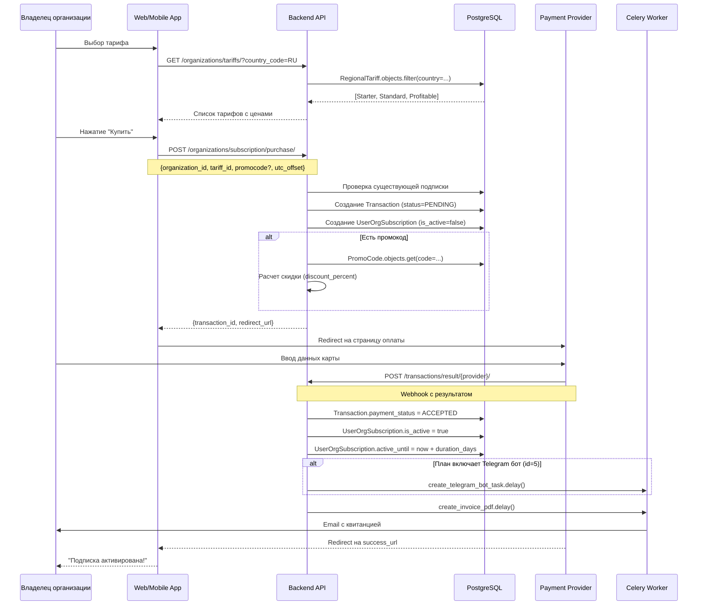
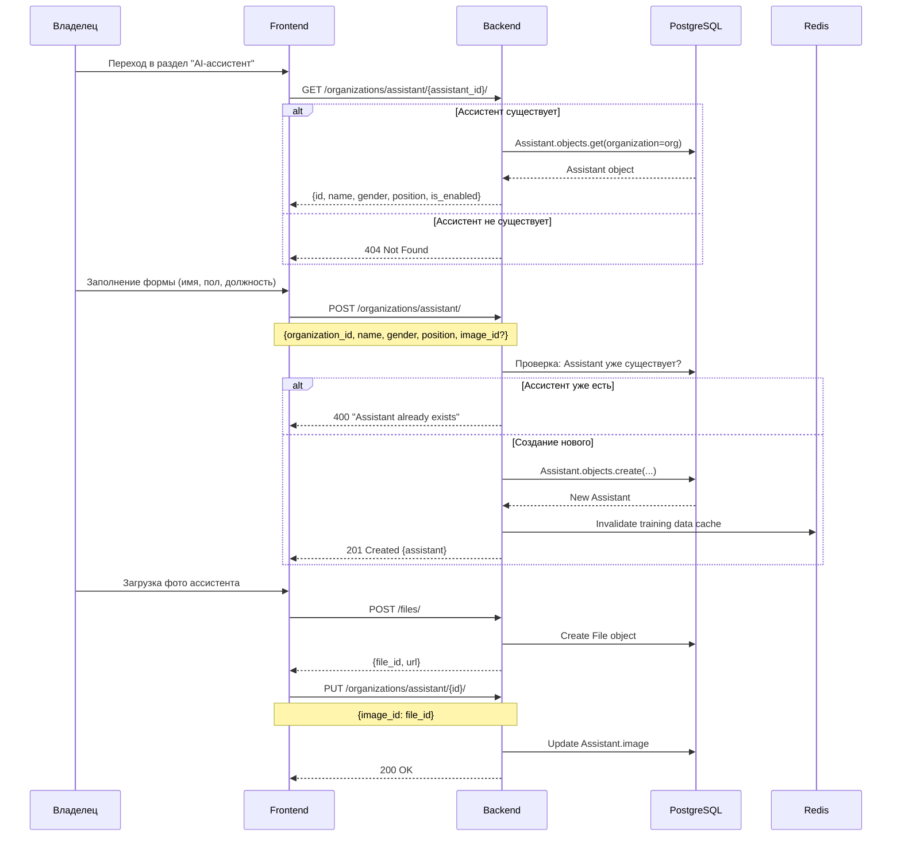
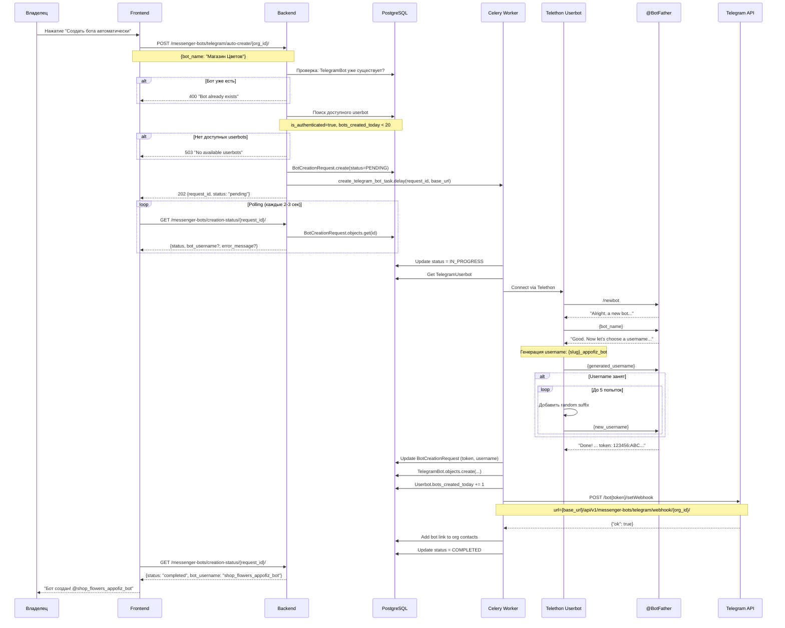
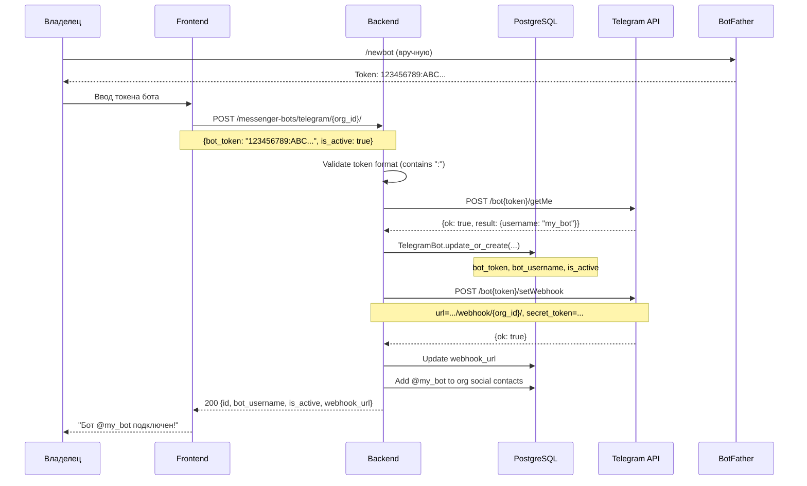
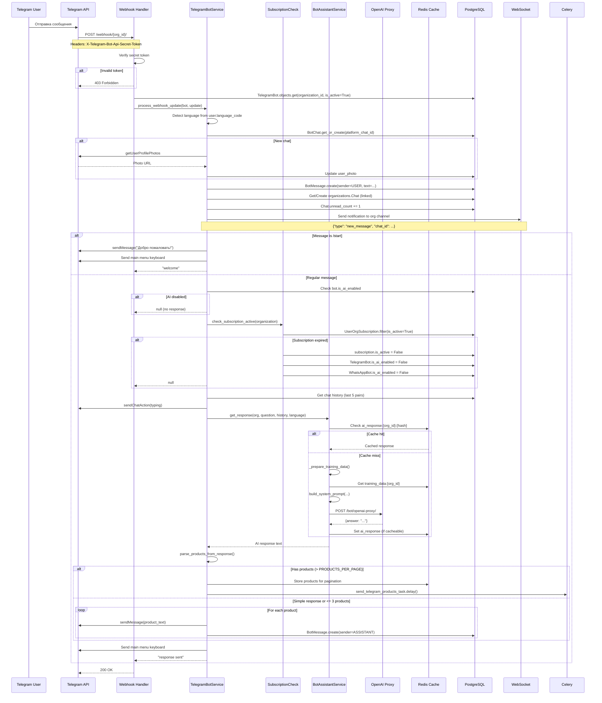
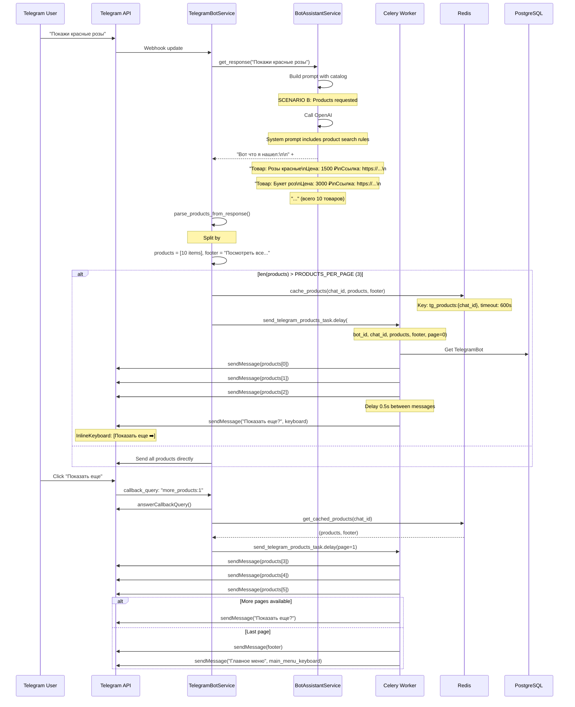
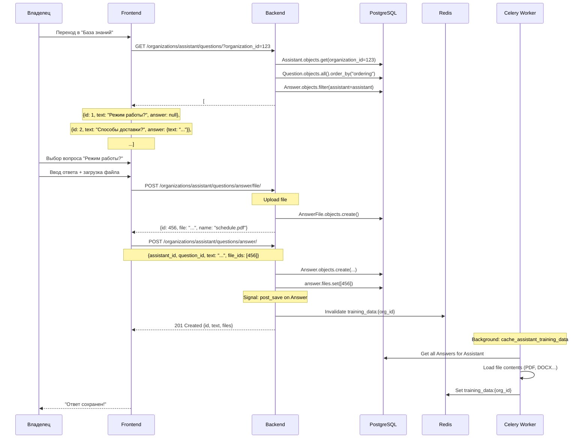
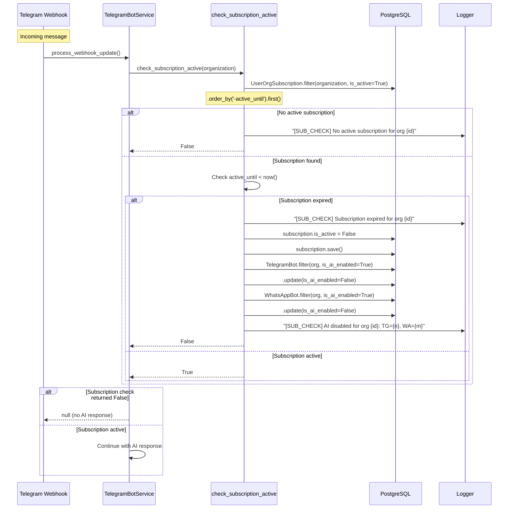
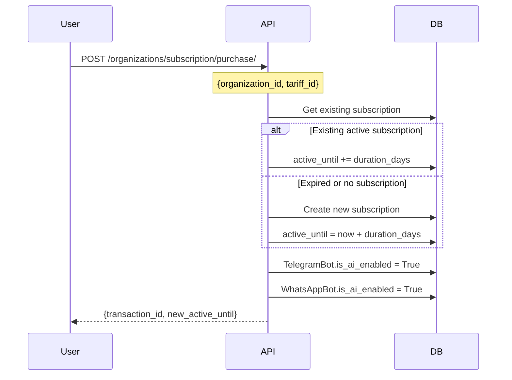

# Пользовательские потоки: Telegram AI-ассистент

## Оглавление

1. [Покупка подписки](#1-покупка-подписки)
2. [Создание AI-ассистента](#2-создание-ai-ассистента)
3. [Автосоздание Telegram бота](#3-автосоздание-telegram-бота)
4. [Ручное подключение бота](#4-ручное-подключение-бота)
5. [Обработка входящего сообщения](#5-обработка-входящего-сообщения)
6. [Запрос товаров через бота](#6-запрос-товаров-через-бота)
7. [Настройка базы знаний](#7-настройка-базы-знаний)
8. [Управление подпиской](#8-управление-подпиской)

---

## 1. Покупка подписки

### Описание
Организация покупает тарифный план для активации функций AI-ассистента и автоматического создания Telegram бота.

### Sequence Diagram



### API Endpoints

| Method | Endpoint | Описание |
|--------|----------|----------|
| GET | `/organizations/tariffs/` | Получить тарифы по региону |
| POST | `/organizations/subscription/purchase/` | Создать подписку |
| GET | `/organization/{id}/active-tariff/` | Проверить активную подписку |

### Валидации

1. **Проверка организации** - пользователь должен быть владельцем или иметь права
2. **Проверка тарифа** - тариф должен быть доступен для страны
3. **Проверка промокода** - если указан, должен быть валидным

### Возможные ошибки

| Код | Ошибка | Описание |
|-----|--------|----------|
| 400 | Invalid tariff | Тариф не найден или недоступен |
| 403 | Permission denied | Нет прав на организацию |
| 406 | Payment failed | Ошибка оплаты |

---

## 2. Создание AI-ассистента

### Описание
Создание и настройка AI-ассистента для организации (OneToOne связь).

### Sequence Diagram



### API Endpoints

| Method | Endpoint | Описание |
|--------|----------|----------|
| GET | `/organizations/assistant/{id}/` | Получить ассистента |
| POST | `/organizations/assistant/` | Создать ассистента |
| PUT | `/organizations/assistant/{id}/` | Обновить ассистента |
| POST | `/organizations/assistant/toggle_assistant/` | Вкл/выкл ассистента |

### Поля ассистента

| Поле | Тип | Обязательное | Описание |
|------|-----|--------------|----------|
| name | string | Да | Имя ассистента (до 255 символов) |
| gender | enum | Да | `male` или `female` |
| position | string | Да | Должность (до 255 символов) |
| image | file | Нет | Фото профиля |
| is_enabled | boolean | Нет | Активен ли (default: true) |

---

## 3. Автосоздание Telegram бота

### Описание
Автоматическое создание Telegram бота через BotFather с использованием Telethon userbot.

### Sequence Diagram



### API Endpoints

| Method | Endpoint | Описание |
|--------|----------|----------|
| POST | `/messenger-bots/telegram/auto-create/{org_id}/` | Запустить автосоздание |
| GET | `/messenger-bots/creation-status/{request_id}/` | Проверить статус |

### Статусы создания

| Статус | Описание |
|--------|----------|
| `pending` | Запрос создан, ожидает обработки |
| `in_progress` | Celery task выполняется |
| `completed` | Бот успешно создан |
| `failed` | Ошибка при создании |

### Ограничения

- **20 ботов/день** на один userbot
- **5 попыток** генерации username
- **60 сек retry** при rate limit от Telegram

---

## 4. Ручное подключение бота

### Описание
Подключение существующего Telegram бота с токеном от BotFather.

### Sequence Diagram



### Валидация токена

```python
def validate_bot_token(value):
    if ":" not in value:
        raise ValidationError(
            "Invalid bot token format. "
            "Token should be in format: 123456789:ABCdefGHI..."
        )
    return value
```

### Возможные ошибки

| Ошибка | Причина | Решение |
|--------|---------|---------|
| Invalid token format | Токен без ":" | Проверить формат |
| Unauthorized | Неверный токен | Получить новый у BotFather |
| Bot not found | Бот удален | Создать нового бота |
| Webhook setup failed | Проблемы с Telegram API | Повторить позже |

---

## 5. Обработка входящего сообщения

### Описание
Полный цикл обработки сообщения от пользователя в Telegram боте.

### Sequence Diagram



### Ключевые проверки

1. **Secret Token** - Telegram передает токен в заголовке
2. **Bot Active** - Бот должен быть активен (`is_active=True`)
3. **AI Enabled** - AI должен быть включен (`is_ai_enabled=True`)
4. **Subscription Active** - Подписка не должна быть истекшей

### Кеширование ответов

```python
# Правила кеширования
COMMON_PATTERNS = ["привет", "hello", "контакты", "contacts", "часы работы"]

def should_cache(question, response):
    # 1. Common patterns - cache immediately
    if is_common_pattern(question):
        return True

    # 2. Per-org frequency >= 3
    org_freq = cache.incr(f"ai_freq:{org_id}:{hash}")
    if org_freq >= 3:
        return True

    # 3. Global frequency >= 20
    global_freq = cache.incr(f"ai_global_freq:{hash}")
    if global_freq >= 20:
        return True

    # 4. Don't cache if has products (prices change)
    if has_products(response):
        return False

    return False
```

---

## 6. Запрос товаров через бота

### Описание
Пользователь запрашивает товары, AI находит релевантные и отправляет с пагинацией.

### Sequence Diagram



### Формат товара от AI

```
Товар: Розы красные премиум
Цена: 1 500 ₽
Ссылка: https://appofiz.com/shop/123/
###NEXT###
Товар: Букет "Романтика"
Цена: 3 000 ₽
Ссылка: https://appofiz.com/shop/456/
```

### Inline Keyboards

**Пагинация:**
```json
{
  "inline_keyboard": [[
    {"text": "Показать еще ➡️", "callback_data": "more_products:1"}
  ]]
}
```

**Главное меню:**
```json
{
  "inline_keyboard": [
    [{"text": "📦 Каталог", "callback_data": "catalog"}],
    [{"text": "📞 Контакты", "callback_data": "contacts"}]
  ]
}
```

---

## 7. Настройка базы знаний

### Описание
Добавление ответов на вопросы для обучения AI-ассистента.

### Sequence Diagram



### Стандартные вопросы

| ID | Вопрос |
|----|--------|
| 1 | Режим работы? |
| 2 | Способы доставки? |
| 3 | Способы оплаты? |
| 4 | Как сделать заказ? |
| 5 | Есть ли скидки? |
| 6 | Где вы находитесь? |
| 7 | Как связаться? |
| 8 | Есть ли гарантия? |
| 9 | Можно ли вернуть товар? |
| 10 | Другое (свободный ответ) |

### Поддерживаемые типы файлов

| Расширение | Обработка |
|------------|-----------|
| .pdf | pypdf / PyPDF2 / pdfplumber |
| .docx | python-docx |
| .txt | Plain text |
| .json | JSON catalog format |
| .csv | CSV parsing |
| .md | Markdown |

---

## 8. Управление подпиской

### Описание
Проверка статуса подписки и автоматическое отключение AI при истечении.

### Sequence Diagram



### Автоматические действия при истечении

1. **Деактивация подписки** - `is_active = False`
2. **Отключение Telegram AI** - `TelegramBot.is_ai_enabled = False`
3. **Отключение WhatsApp AI** - `WhatsAppBot.is_ai_enabled = False`
4. **Логирование** - Запись в лог с деталями

### Ручное продление



---

## Приложение: Callback Data Format

| Callback | Формат | Описание |
|----------|--------|----------|
| catalog | `catalog` | Показать категории |
| contacts | `contacts` | Показать контакты |
| category | `cat_{id}` | Товары категории |
| product | `prod_{id}` | Детали товара |
| more | `more_products:{page}` | Пагинация |
| back | `back` | Назад в меню |
