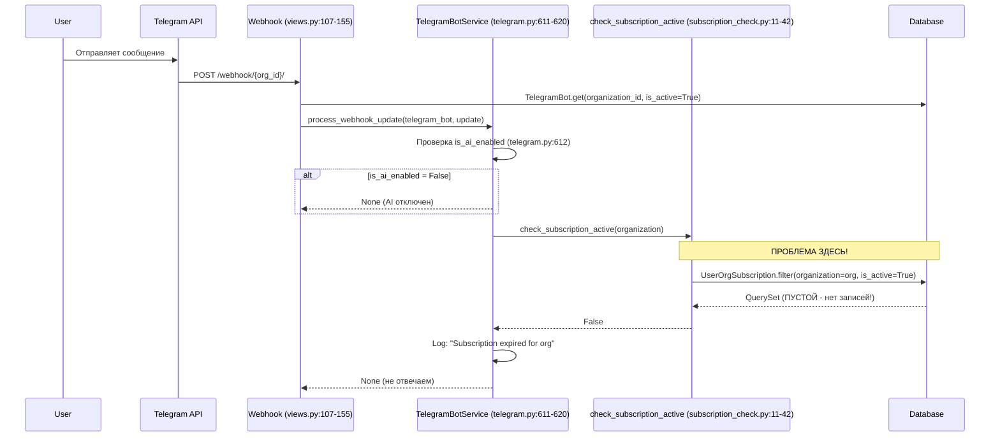
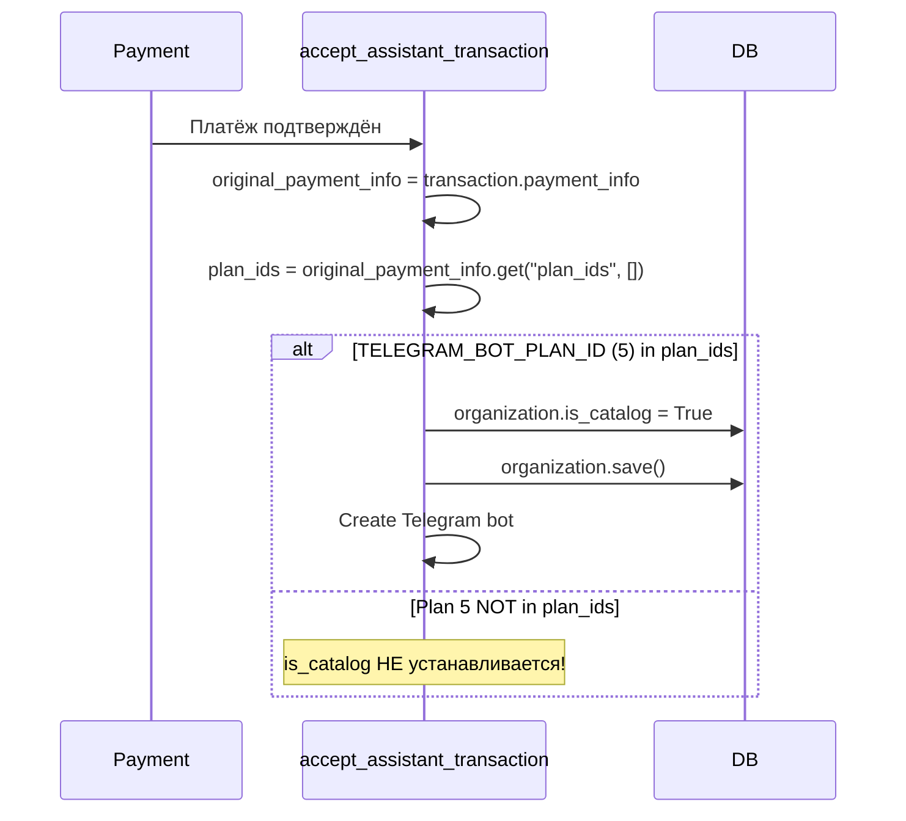

# Диагностика критических багов Telegram AI-ассистента

## Дата: 2026-01-27

---

## BUG #1: Telegram бот не отвечает после покупки подписки

### Симптомы
- Пользователь покупает подписку на AI-ассистента с Telegram ботом
- Подписка активируется, бот создаётся
- Бот получает сообщения, но НЕ отвечает
- В логах: `[SUB_CHECK] No active subscription for org {id}`

### Цепочка обработки сообщения



### КОРНЕВАЯ ПРИЧИНА

**Файл:** [subscription_check.py:11-24](messenger_bots/services/subscription_check.py#L11-L24)

```python
def check_subscription_active(organization) -> bool:
    from organizations.models import UserOrgSubscription  # <-- ТОЛЬКО UserOrgSubscription!

    subscription = (
        UserOrgSubscription.objects
        .filter(organization=organization, is_active=True)  # <-- Проверяет ТОЛЬКО эту модель
        .order_by('-active_until')
        .first()
    )

    if not subscription:
        logger.info(f"[SUB_CHECK] No active subscription for org {organization.id}")
        return False  # <-- ВОЗВРАЩАЕТ FALSE!
```

**Проблема:** Функция `check_subscription_active` проверяет ТОЛЬКО модель `UserOrgSubscription`, но при покупке AI-ассистента создаётся запись в модели `UserAssistant`!

### Две разные модели подписок

| Модель | Когда создаётся | Поля |
|--------|-----------------|------|
| `UserOrgSubscription` | Покупка подписки на организацию | `organization`, `is_active`, `active_until` |
| `UserAssistant` | Покупка AI-ассистента | `assistant` → `organization`, `is_active`, `active_until` |

### Где создаётся UserAssistant

**Файл:** [assistant_services.py:92-113](organizations/services/assistant_services.py#L92-L113)

```python
def create_or_renew_user_assistant(cls, ...):
    user_assistant = UserAssistant.objects.create(
        user=user,
        assistant=assistant,  # assistant.organization = organization
        transaction=transaction,
        active_until=timezone.now() + timedelta(days=duration_days)
    )
```

**Файл:** [transaction_services.py:3977-3979](transactions/services/transaction_services.py#L3977-L3979)

```python
def accept_assistant_transaction(cls, transaction_id):
    user_assistant = transaction_obj.user_assistants
    user_assistant.is_active = True  # <-- Активируется UserAssistant
    user_assistant.save()
```

### ИСПРАВЛЕНИЕ

**Файл:** `messenger_bots/services/subscription_check.py`

```python
def check_subscription_active(organization) -> bool:
    """Check if organization has an active subscription.

    Checks both:
    - UserOrgSubscription (org subscription)
    - UserAssistant (AI assistant subscription)
    """
    from django.utils import timezone
    from organizations.models import UserOrgSubscription, UserAssistant

    # Check 1: UserOrgSubscription (подписка на организацию)
    org_subscription = (
        UserOrgSubscription.objects
        .filter(organization=organization, is_active=True)
        .order_by('-active_until')
        .first()
    )

    if org_subscription:
        if org_subscription.active_until and org_subscription.active_until < timezone.now():
            org_subscription.is_active = False
            org_subscription.save(update_fields=['is_active'])
            _disable_ai_for_organization(organization)
            return False
        return True

    # Check 2: UserAssistant (подписка на AI-ассистента)
    assistant_subscription = (
        UserAssistant.objects
        .filter(
            assistant__organization=organization,
            is_active=True
        )
        .order_by('-active_until')
        .first()
    )

    if assistant_subscription:
        if assistant_subscription.active_until and assistant_subscription.active_until < timezone.now():
            assistant_subscription.is_active = False
            assistant_subscription.save(update_fields=['is_active'])
            _disable_ai_for_organization(organization)
            return False
        return True

    logger.info(f"[SUB_CHECK] No active subscription for org {organization.id}")
    return False
```

---

## BUG #2: is_catalog не устанавливается в TRUE

### Симптомы
- Пользователь покупает план "Все включено" (ID=5) с Telegram ботом
- Бот создаётся
- Флаг `organization.is_catalog` остаётся `False` или `NULL`
- Каталог товаров не работает в AI-ответах

### Цепочка установки is_catalog



### Ключевой код

**Файл:** [transaction_services.py:3992-4003](transactions/services/transaction_services.py#L3992-L4003)

```python
# Create Telegram bot and enable catalog if "Все включено" plan (id=5) was selected
TELEGRAM_BOT_PLAN_ID = 5
plan_ids = original_payment_info.get("plan_ids", [])  # <-- Может быть пустым!
base_url = original_payment_info.get("base_url")

if TELEGRAM_BOT_PLAN_ID in plan_ids:  # <-- Условие может не выполняться
    # Enable catalog mode for AI assistant
    organization = transaction_obj.organization
    if not organization.is_catalog:
        organization.is_catalog = True
        organization.save(update_fields=["is_catalog"])
        logging.info(f"[PAYMENT] Enabled is_catalog for org {organization.id}")
```

### ВОЗМОЖНЫЕ ПРИЧИНЫ

#### Причина 2.1: Неверный ID плана
- Константа `TELEGRAM_BOT_PLAN_ID = 5` захардкожена в 3 местах
- Если в базе ID плана "Все включено" не равен 5, условие не сработает

**Файлы с хардкодом:**
- [assistant_views.py:204](organizations/views/assistant_views.py#L204)
- [transaction_services.py:3993](transactions/services/transaction_services.py#L3993)

**Проверка:**
```sql
SELECT id, name FROM organizations_plan WHERE name LIKE '%включено%' OR name LIKE '%telegram%';
```

#### Причина 2.2: plan_ids не передаётся
- `original_payment_info.get("plan_ids", [])` возвращает пустой список
- Проверить: `payment_info` правильно сохраняется при создании транзакции?

**Файл создания:** [assistant_services.py:49-56](organizations/services/assistant_services.py#L49-L56)

```python
plan_ids = [p.id for p in plans]
payment_info = {
    "purchase_type": "assistant",
    "plan_ids": plan_ids,  # <-- Должен содержать ID планов
}
```

**Проверка:**
```sql
SELECT id, payment_info
FROM transactions_transaction
WHERE type = 'assistant'
ORDER BY created_at DESC
LIMIT 5;
```

#### Причина 2.3: payment_info перезаписывается
- Строка 3968-3970 может затереть данные?

```python
balance_data = BalanceInTransactionSerializer(balance).data if balance else {}
transaction_obj.payment_info = {**original_payment_info, "balance": balance_data}
```

Нет, здесь используется `{**original_payment_info, ...}`, поэтому данные сохраняются.

### ИСПРАВЛЕНИЕ

**Вариант A: Вынести ID плана в настройки**

```python
# settings.py
TELEGRAM_BOT_PLAN_ID = int(os.getenv("TELEGRAM_BOT_PLAN_ID", "5"))

# transaction_services.py
from django.conf import settings
if settings.TELEGRAM_BOT_PLAN_ID in plan_ids:
    ...
```

**Вариант B: Добавить логирование для диагностики**

```python
# transaction_services.py:3994
plan_ids = original_payment_info.get("plan_ids", [])
logging.info(f"[PAYMENT] plan_ids={plan_ids}, checking for TELEGRAM_BOT_PLAN_ID={TELEGRAM_BOT_PLAN_ID}")

if TELEGRAM_BOT_PLAN_ID in plan_ids:
    logging.info(f"[PAYMENT] Found Telegram Bot plan in plan_ids")
    ...
else:
    logging.warning(f"[PAYMENT] Telegram Bot plan NOT in plan_ids for org {transaction_obj.organization_id}")
```

---

## Диагностические SQL-запросы

### Проверка подписок для организации

```sql
-- Проверить UserOrgSubscription
SELECT id, organization_id, is_active, active_until, created_at
FROM organizations_userorgsubscription
WHERE organization_id = {ORG_ID}
ORDER BY created_at DESC;

-- Проверить UserAssistant
SELECT ua.id, ua.is_active, ua.active_until, a.organization_id
FROM organizations_userassistant ua
JOIN organizations_assistant a ON ua.assistant_id = a.id
WHERE a.organization_id = {ORG_ID}
ORDER BY ua.created_at DESC;
```

### Проверка транзакций и plan_ids

```sql
SELECT
    t.id,
    t.organization_id,
    t.type,
    t.payment_status,
    t.payment_info,
    t.created_at
FROM transactions_transaction t
WHERE t.type = 'assistant'
  AND t.organization_id = {ORG_ID}
ORDER BY t.created_at DESC
LIMIT 5;
```

### Проверка is_catalog

```sql
SELECT id, title, is_catalog
FROM organizations_organization
WHERE id = {ORG_ID};
```

### Проверка плана "Все включено"

```sql
SELECT id, name, is_best_choice, price
FROM organizations_plan
ORDER BY id;
```

---

## Шаги для тестирования после исправления

### Тест BUG #1

1. Создать тестовую организацию
2. Купить подписку на AI-ассистента (UserAssistant)
3. Отправить сообщение в Telegram бот
4. **Ожидание:** Бот должен ответить
5. Проверить логи: `[SUB_CHECK]` должен показать успешную проверку

### Тест BUG #2

1. Создать тестовую организацию с `is_catalog=False`
2. Купить план "Все включено" (ID=5)
3. **Ожидание:** `is_catalog` должен стать `True`
4. Проверить логи: `[PAYMENT] Enabled is_catalog for org {id}`
5. Проверить что бот создан

---

## Резюме

| Баг | Причина | Файл | Строки | Сложность фикса |
|-----|---------|------|--------|-----------------|
| #1 Bot не отвечает | Проверяется только `UserOrgSubscription`, а не `UserAssistant` | subscription_check.py | 17-24 | Средняя |
| #2 is_catalog=False | Хардкод ID=5 или plan_ids пустой | transaction_services.py | 3993-4003 | Низкая |

**Приоритет:** BUG #1 - критический, блокирует основной функционал.
